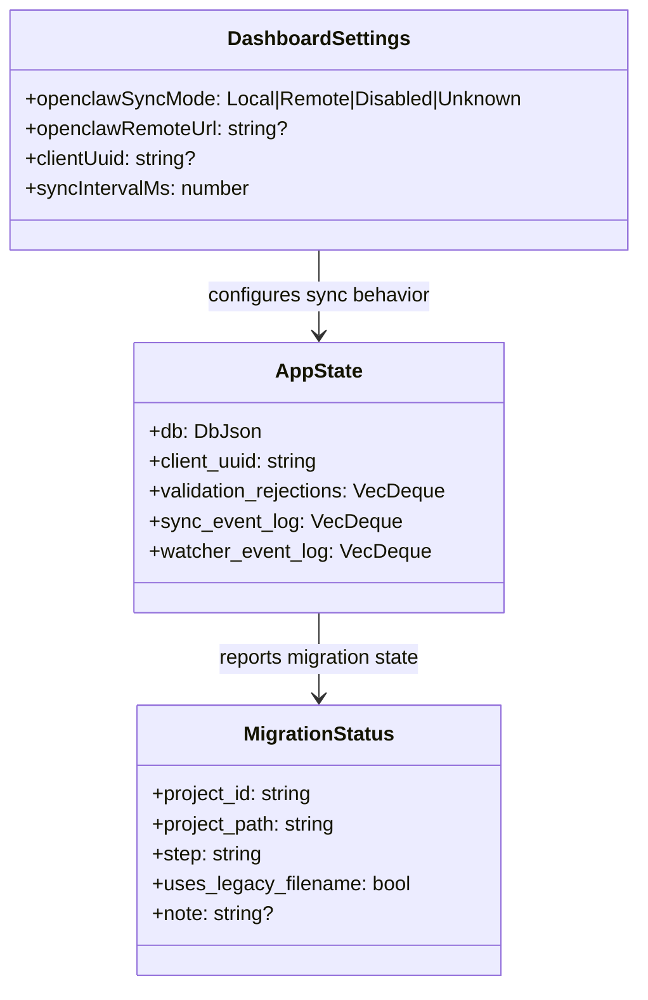

# Architecture Direction Part Two: Delivery Plan (Reconciled)

> Close the remaining Part Two delivery gaps with a staged, test-gated execution plan based on current code reality.

## Summary

Part Two already has an implementation plan, but the codebase shows a mixed state: some items are done or partially done, while several critical items remain open. This plan reconciles the original Part Two scope against the current repository and focuses execution on unresolved gaps only. It preserves the original priority intent: production usability first, multi-device correctness second, cleanup and observability third.

## Enhancement Summary

**Deepened on:** 2026-02-24  
**Sections enhanced:** 8  
**Research agents used:** `architecture-strategist`, `performance-oracle`, `security-sentinel`, `data-integrity-guardian`, `data-migration-expert`, `code-simplicity-reviewer`, `agent-native-reviewer`, `kieran-typescript-reviewer`, `spec-flow-analyzer`, `repo-research-analyst`, `learnings-researcher`, `framework-docs-researcher`, `best-practices-researcher`, `code-architect`, `code-reviewer`, `code-explorer`

### Key Improvements

1. Added concrete performance and reliability SLO-style targets for reorder and watcher ingestion.
2. Clarified migration and remote-sync sequencing with idempotence, observability, and rollback expectations.
3. Added implementation-level guidance for configurable sync intervals, bounded debug ring buffers, and token handling.

### New Considerations Discovered

- Rust already exposes `get_openclaw_bearer_token` but frontend wiring is incomplete; plan now emphasizes integration before adding net-new primitives.
- Sync loop currently uses fixed `sleep(2s)`; move to configurable interval semantics with explicit missed-tick behavior to avoid burst catch-up effects.

---

**Roadmap Item:** `architecture-direction-part-two`  
**Status:** Draft  
**Created:** 2026-02-24  
**Type:** `fix`  
**Detail Level:** `A LOT`  
**Predecessors:** `docs/plans/architecture-direction-plan-v2.md`, `docs/plans/2026-02-22-feat-architecture-direction-part-two-plan.md`

---

## Feature Description

Create an up-to-date delivery plan for Architecture Direction Part Two using the Part Two plan as primary scope, and Part One deferred notes as supplemental context where needed.

## Section Manifest

Section 1: `Research Consolidation` — source-of-truth gap analysis and dependency verification.  
Section 2: `SpecFlow Analysis` — user/system flows where Part Two gaps surface first.  
Section 3: `Scope` — explicit inclusion/exclusion boundaries to prevent scope drift.  
Section 4: `Proposed Solution` — phased execution model with ordered delivery gates.  
Section 5: `Technical Approach` — command contracts, type boundaries, and lifecycle behavior.  
Section 6: `Acceptance Criteria` — measurable functional/non-functional outcomes and quality gates.  
Section 7: `Risks and Mitigations` — failure modes, blast radius, and containment strategy.  
Section 8: `References and Research` — internal and external grounding artifacts.

## Research Consolidation

### Repo Findings

- Part Two exists as a plan document and enumerates 10 deferred items: `docs/plans/2026-02-22-feat-architecture-direction-part-two-plan.md:24`.
- Current roadmap state still marks the item in progress and describes unresolved gaps in detail: `.clawchestra/state.json:15`.
- Item 9 (event cascade) is partially addressed: `state-json-merged` now uses `updateProjectFromEvent`, and other reloads are debounced: `src/App.tsx:1103`, `src/App.tsx:463`.
- Item 8 (batch reorder) is still unresolved; reorder path remains N IPC calls via `Promise.all(reorderItem(...))`: `src/hooks/useProjectModal.ts:203`.
- Item 2 (migration auto-trigger) is unresolved in the Part Two sense; `run_all_migrations` exists but startup runs `run_migrations()` for settings/db chores only: `src-tauri/src/lib.rs:2159`, `src-tauri/src/lib.rs:439`.
- Item 3 (debug ring buffers) is unresolved; debug export still prints placeholder watcher tracking text: `src-tauri/src/lib.rs:2650`.
- Item 4 (`get_migration_status` NotStarted visibility) is unresolved; only iterates `guard.db.projects`: `src-tauri/src/lib.rs:2114`.
- Item 1 (remote sync) is partial; remote sync functions exist but are not integrated into app lifecycle and sync status UX remains unwired (`null`): `src/lib/sync.ts:107`, `src/App.tsx:1968`.
- Item 5 (configurable sync interval) is unresolved; sync loop remains hardcoded `Duration::from_secs(2)`: `src-tauri/src/sync.rs:782`.
- Item 6 is already delivered (`AUTO_COMMIT_ALLOWED` only `CLAWCHESTRA.md`): `src/lib/auto-commit.ts:5`.
- Item 7 is unresolved; legacy fields and ROADMAP/CHANGELOG path handling remain in active types and loaders: `src/lib/schema.ts:166`, `src/lib/projects.ts:125`.
- Item 10 is unresolved in planned form; injection lacks explicit “DO NOT create PROJECT.md/ROADMAP.md/CHANGELOG.md” block: `src-tauri/src/injection.rs:21`, `src-tauri/src/injection.rs:67`.

### Institutional Learnings

Source: `docs/solutions/refactoring/large-scale-tauri-architecture-overhaul.md`.

Key carry-forwards:

- Run work in explicit phases with validation gates after each phase.
- Perform dead-code sweep explicitly, not implicitly.
- Trace contracts end-to-end when changing command payloads/types.
- Treat settings/schema migration with defensive defaults and sanitization.

Secondary operational lesson:

- Keep investigation loops bounded and batched to prevent runaway iteration cost: `docs/solutions/high-token-usage-lessons-opus46-2026-02-20.md`.

### External Research Decision

Targeted external validation completed for runtime semantics.

Rationale:

- This is an internal architecture completion effort with strong local documentation, existing plan artifacts, and concrete code references.
- We still validated specific Tauri/Tokio lifecycle and interval behavior to tighten implementation details for phases touching sync loops and app events.

### Research Insights

**Best Practices:**
- Preserve existing working primitives where present (`run_all_migrations`, `get_openclaw_bearer_token`) and prioritize missing integration paths before introducing new commands.
- Keep `state.json` projection writes coalesced around semantic operations (one reorder action -> one write/event path).

**Performance Considerations:**
- Treat full-project reloads as expensive and rate-limited; prefer payload-driven delta updates wherever event payloads already contain changed data.
- Capture p95 timings during Phase 0 so Phase 1/3 changes can be validated against baseline, not intuition.

**Implementation Details:**
- Existing code confirms unresolved integration points:
  - `src/hooks/useProjectModal.ts` still does per-item reorder IPC fanout.
  - `src/App.tsx` sync status display still receives `null` timestamps/errors.
  - `src/components/SettingsForm.tsx` persists remote URL/mode but has no bearer-token field.

**Edge Cases:**
- Projects migrated before `state_json_migrated` flag introduction can appear partially aligned unless startup sweep logic is deterministic and idempotent.
- Remote sync failures should not collapse into generic UI failures; status must encode last error with retry path.

## SpecFlow Analysis

### Flow 1: Roadmap Reorder (User drag in modal)

Current:

- Migrated projects reorder via per-item `reorderItem` calls in parallel.

Gap:

- Produces N writes/events, risking lag and contention.

Required:

- Single batch mutation command for reorder operations.

### Flow 2: Watcher/Event Ingestion During Active Agent Work

Current:

- Delta update path exists for `state-json-merged`; file/git events use debounced reload.

Gap:

- Debounce window and fallback reload paths need hard verification under sustained write bursts.

Required:

- Keep delta-first handling; cap full rescans; instrument and assert max reload frequency.

### Flow 3: Startup Migration Detection and Execution

Current:

- Startup performs settings/data-dir migration chores and sync-on-launch (local), but not Part Two migration auto-trigger semantics.

Gap:

- NotStarted project migration and rename behavior are not guaranteed at launch through the intended migration command path.

Required:

- Deterministic startup migration sweep for eligible projects with user-visible summary.

### Flow 4: Remote Sync Lifecycle

Current:

- Remote sync helper functions exist; lifecycle invocation and UX/status plumbing remain incomplete.

Gap:

- No integrated startup/close call path; bearer token UX/transport path incomplete; sync status telemetry not surfaced.

Required:

- End-to-end remote mode path with keyring token read/write, lifecycle calls, and status display.

### Flow 5: Agent Guidance Injection

Current:

- Injection updates integration section and replacement strings.

Gap:

- Missing explicit deprecated-file prohibition language required to stop PROJECT/ROADMAP recreation.

Required:

- Explicit deprecation block + tests for injected output.

### Flow 6: Debug Export Observability

Current:

- Debug export includes migration/history/rejections and a watcher placeholder.

Gap:

- No sync/watcher event ring buffers for actionable diagnostics.

Required:

- Bounded event logs (sync + watcher) and export integration.

### Flow 7: Migration Status Visibility

Current:

- Status command only includes DB-known projects.

Gap:

- NotStarted visibility mismatch for projects not yet in DB.

Required:

- Include discovery note minimum; optionally include filesystem-aware listing.

### Research Insights

**Best Practices:**
- Keep mutation surfaces explicit: reorder, migration, and sync should each have one canonical command path and typed frontend wrapper.
- Separate semantic deltas (`state-json-merged`) from structural reload triggers (file/git events) to prevent unnecessary rescans.

**Performance Considerations:**
- Reorder flow target: one IPC call, one projection write, one merged event per user drag action.
- Event ingestion target: cap full `loadProjects()` invocations during churn (e.g., <= 4 calls/second sustained under load).

**Implementation Details:**
- Flow 4 should treat token handling as integration-first:
  - Wire frontend wrappers for `get_openclaw_bearer_token`, `set_openclaw_bearer_token`, and `clear_openclaw_bearer_token`.
  - Keep keyring as sole source of truth; never persist bearer tokens in settings JSON.
- Flow 6 ring buffers should be bounded `VecDeque` with fixed cap and oldest-drop behavior.

**Edge Cases:**
- Cross-column reorder can create temporary duplicate priorities; batch command must normalize and emit deterministic ordering.
- Migration summary events should never block app readiness; failures become warnings with retry path, not startup aborts.

## Scope

### In Scope

- Deliver unresolved Part Two items: 1,2,3,4,5,7,8,10.
- Harden and verify partially delivered Item 9.
- Regression-protect delivered Item 6.

### Out of Scope

- New architecture beyond Part Two.
- Mobile/web productization work deferred in broader architecture docs.
- Non-Part-Two roadmap expansions.

## Proposed Solution

Execute in six phases with strict gates, preserving Part Two ordering and current-reality adjustments.

### Phase 0: Baseline and Measurement Harness

Tasks:

- [ ] `src/App.tsx` add temporary profiling counters/log markers for `loadProjects()` frequency during watcher storms.
- [ ] `src/hooks/useProjectModal.ts` add temporary timing around reorder persistence path.
- [ ] `src-tauri/src/lib.rs` add scoped debug logs for migration auto-path decisions.

Deliverables:

- Baseline metrics doc section appended to this plan before coding Phase 1.

### Phase 1: Performance Completion (Items 8 + 9 hardening)

Tasks:

- [x] `src-tauri/src/lib.rs` add `batch_reorder_items` command and register handler.
- [x] `src/lib/tauri.ts` add typed wrapper `batchReorderItems(...)`.
- [x] `src/hooks/useProjectModal.ts` replace per-item `Promise.all(reorderItem(...))` with single batch call.
- [x] `src/App.tsx` verify no remaining reorder hot paths call per-item writes for migrated projects.
- [ ] `src/App.tsx` tune debounce windows if profiling still exceeds target under bursty writes.

Acceptance:

- [ ] One drag reorder operation for migrated project issues one backend mutation command.
- [ ] During simulated active agent file churn, UI remains responsive and reload frequency is bounded.

### Phase 2: Migration Path Completion (Items 2 + 4)

Tasks:

- [x] `src-tauri/src/lib.rs` implement startup auto-migration sweep for NotStarted/legacy cases.
- [x] `src-tauri/src/lib.rs` emit launch migration summary event (count + warning count).
- [x] `src/App.tsx` consume migration summary event and show success/warning toast.
- [x] `src-tauri/src/lib.rs` update `get_migration_status` response to clarify discovery scope and/or include non-DB candidates.

Acceptance:

- [x] Legacy/not-started projects are migrated at launch with idempotent behavior.
- [x] Migration status output no longer silently implies full discovery when it is DB-only.

### Phase 3: Remote Sync Completion (Items 1 + 5)

Tasks:

- [x] `src/lib/tauri.ts` expose typed bearer-token command wrappers: `getOpenclawBearerToken`, `setOpenclawBearerToken`, `clearOpenclawBearerToken`.
- [x] `src-tauri/src/lib.rs` keep keyring token storage authoritative and out of serialized settings; add explicit `set_openclaw_bearer_token` and `clear_openclaw_bearer_token` commands.
- [x] Token source-of-truth contract: keyring is canonical; settings JSON never stores bearer token; startup/close sync always resolves token via keyring command path.
- [x] `src/components/SettingsForm.tsx` add remote bearer token UX (masked value + replace/clear actions) and save flow.
- [x] `src/App.tsx` wire launch/close sync lifecycle for remote mode using `performSyncOnLaunch` / `performSyncOnClose`.
- [x] `src/App.tsx` wire sync status display with real `lastSyncedAt`/error state.
- [x] `src-tauri/src/lib.rs` + `src/lib/settings.ts` + `src/components/SettingsForm.tsx` add persisted sync interval setting(s) and sanitization (min/max bounds, defaults).
- [x] `src-tauri/src/sync.rs` make continuous sync interval configurable and mode-gated:
  - [x] `Local`: run Rust continuous sync loop.
  - [x] `Remote` / `Disabled`: do not run local filesystem continuous sync loop.

Acceptance:

- [ ] Remote GET/merge/PUT path runs successfully with valid URL/token.
- [ ] Invalid URL/token reports error without crash.
- [x] Sync indicator shows real status metadata.
- [x] Token resolution order is deterministic and documented (keyring only, no settings fallback).
- [x] Sync interval value persists across restart and is clamped to safe bounds.
- [x] Remote/Disabled modes do not execute local continuous sync cycles.

### Phase 4: Agent Guidance Hardening (Item 10)

Tasks:

- [x] `src-tauri/src/injection.rs` extend injected section with explicit deprecated-file prohibitions:
  - [x] `PROJECT.md` do not create
  - [x] `ROADMAP.md` do not create
  - [x] `CHANGELOG.md` do not create
- [x] `src-tauri/src/injection.rs` update replacement coverage for common legacy directives.
- [x] `src-tauri/src/injection.rs` tests assert injected text contains deprecation block.

Acceptance:

- [x] Injection output contains explicit “DO NOT create” language.
- [x] Regression tests cover deprecation block presence.

### Phase 5: Cleanup and Type Contract Simplification (Item 7 + Item 6 regression)

Tasks:

- [x] Phase 5 precondition gate (must pass before deleting legacy paths):
  - [x] No active runtime reads/writes depend on ROADMAP.md/CHANGELOG.md for migrated projects.
  - [x] Migration status in normal startup flow shows no `NotStarted` projects requiring legacy fallback.
- [x] `src/lib/schema.ts` remove `hasChangelog`, `roadmapFilePath`, `changelogFilePath` from `ProjectViewModel` only after precondition gate passes.
- [x] `src/lib/projects.ts` remove ROADMAP/CHANGELOG companion-file detection for migrated path.
- [x] `src/hooks/useProjectModal.ts` remove legacy changelog/ROADMAP fallback once full migration path is guaranteed.
- [x] `src/lib/auto-commit.ts` add regression test/assertion to preserve `CLAWCHESTRA.md`-only allowlist.

Acceptance:

- [x] TypeScript compile passes with simplified model.
- [x] No runtime reads/writes rely on ROADMAP.md/CHANGELOG.md in migrated flow.

### Phase 6: Debug Export Ring Buffers (Item 3)

Tasks:

- [x] `src-tauri/src/state.rs` add bounded `sync_event_log` and `watcher_event_log` structures.
- [x] `src-tauri/src/sync.rs` append sync events per cycle.
- [x] `src-tauri/src/watcher.rs` append watcher events on categorized changes.
- [x] `src-tauri/src/lib.rs` export these logs in `export_debug_info()` instead of placeholder text.

Acceptance:

- [x] Debug export includes recent sync/watcher entries.
- [x] Buffers are capacity-limited and roll forward.

### Research Insights

**Best Practices:**
- Phase boundaries should be enforced with evidence capture: before/after metrics, command traces, and targeted regression tests.
- Keep each phase additive first; perform destructive cleanup (legacy field removal) only after parity validation in prior phases.

**Performance Considerations:**
- Add explicit benchmarks in Phase 0 and re-run after Phases 1 and 3:
  - Reorder p95 end-to-end latency
  - `loadProjects` invocation rate under watcher storm
  - sync cycle duration and error rate

**Implementation Details:**
- For configurable sync intervals, use `tokio::time::interval` and set missed tick behavior intentionally (`Skip` preferred for sync polling) instead of fixed `sleep`.
- For debug buffers, include timestamp, source, and compact payload metadata (project id, event type, duration/error code).

**Edge Cases:**
- Very small sync intervals can starve other async tasks; enforce sane minimums and sanitize settings.
- Debug export should truncate oversized payloads to avoid creating a new “debug export causes lag” failure mode.

## Technical Approach

### Command and Type Contract Strategy

- Extend Tauri commands before frontend consumers.
- Keep response payloads typed in `src/lib/tauri.ts` and avoid untyped fallbacks.
- Stage schema/type removals only after runtime paths are cut over.

### Safety and Sequencing

- Keep each phase behind compile/test gates.
- Prefer additive changes, then remove dead paths once parity is verified.
- Preserve idempotence for startup migration/sync routines.

### Research Insights

**Best Practices:**
- Tauri command registration should remain centralized in a single `generate_handler!` list to avoid handler drift between Rust and TypeScript contracts.
- Event payloads should be typed structs and reused at frontend listeners to reduce ad-hoc JSON parsing paths.

**Performance Considerations:**
- Use interval-based scheduling for periodic sync loops to avoid cumulative drift and to keep behavior explicit under slow-cycle conditions.
- Prefer a shared “schedule and coalesce” pattern for expensive reloads (`scheduleLoadProjects`) across all watcher-driven triggers.
- Ensure interval loop behavior is mode-aware (local-only continuous sync) to avoid hidden background churn in remote/disabled modes.

**Implementation Details:**

```rust
// src-tauri/src/sync.rs (target shape)
use tokio::time::{interval, Duration, MissedTickBehavior};

let mut ticker = interval(Duration::from_millis(sync_interval_ms));
ticker.set_missed_tick_behavior(MissedTickBehavior::Skip);

loop {
    tokio::select! {
        _ = ticker.tick() => {
            perform_continuous_sync(&state).await;
        }
        _ = shutdown_signal.notified() => break,
    }
}
```

```ts
// src/App.tsx (target shape)
const syncOutcome = await performSyncOnLaunch(
  dashboardSettings.openclawSyncMode,
  dashboardSettings.openclawRemoteUrl,
  bearerToken
);
setLastSyncedAt(Date.now());
setLastSyncError(syncOutcome.success ? null : syncOutcome.message);
```

**Edge Cases:**
- Frontend wrappers and backend command names must be changed in lockstep; otherwise runtime invoke failures can silently skip critical lifecycle sync.
- Teardown sync on close must honor timeout budgets so app exit is not blocked indefinitely by remote network stalls.

### Pseudocode Sketches

#### `src-tauri/src/lib.rs` (`batch_reorder_items`)

```rust
// src-tauri/src/lib.rs
#[tauri::command]
async fn batch_reorder_items(project_id: String, items: Vec<BatchReorderInput>, ...) -> Result<(), String> {
    // 1) lock once
    // 2) apply all item priority/status updates with one HLC step strategy
    // 3) write one state.json projection
    // 4) schedule one db flush
    // 5) emit one merged event payload
}
```

#### `src/App.tsx` (remote sync lifecycle)

```ts
// src/App.tsx
useEffect(() => {
  // on startup: if Remote, fetch token via tauri + run performSyncOnLaunch
  // on teardown: run performSyncOnClose with timeout budget
}, []);
```

## Alternative Approaches Considered

- Keep per-item reorder and only increase debounce: rejected because write/event amplification remains.
- Defer remote sync UX and rely on local-only sync: rejected because it leaves the stated multi-device goal incomplete.
- Keep legacy `ProjectViewModel` fields indefinitely: rejected due ongoing complexity and stale-path bugs.

## Acceptance Criteria

### Functional

- [ ] Remaining Part Two items are implemented and verified with evidence.
- [ ] Architecture-direction-part-two roadmap item points to this plan and has actionable `nextAction`.

### Non-Functional

- [ ] Reorder and event handling remain responsive under bursty agent writes.
- [ ] Startup migration and remote sync are idempotent and failure-tolerant.

Quantified targets:

- [ ] Reorder p95 commit-to-render latency <= 120ms on a 25-item migrated project.
- [ ] Watcher churn test keeps full `loadProjects()` calls <= 4/sec sustained.
- [ ] Remote sync failure path updates UI status within 2s of error detection.

### Quality Gates

- [x] `bun test`
- [x] `npx tsc --noEmit`
- [x] `cargo check`
- [x] `cargo test` (or targeted `cargo test` for changed modules/commands)
- [x] `pnpm build`
- [x] `npx tauri build --no-bundle` (verification build before handoff)
- [ ] Targeted integration checks:
  - [x] Drag reorder issues exactly one batch command for migrated projects.
  - [ ] Migration summary event emits at startup and UI toasts once.
  - [ ] Debug export includes non-placeholder watcher/sync ring buffer entries.

## Risks and Mitigations

- Migration auto-trigger could touch unexpected projects: guard with explicit eligibility checks and summary telemetry.
- Remote sync credential misconfiguration could degrade UX: validate settings and show clear error states.
- Dead-code cleanup could break fallback paths: remove only after migration completion gates pass.

### Research Insights

**Security Considerations:**
- Never serialize bearer tokens back into settings payloads; keyring remains the sole durable storage.
- Debug export must redact token-like strings and absolute-secret material.

**Data Integrity Considerations:**
- Batch reorder should be atomic per project mutation (single lock window, single projection write) to avoid partially applied priority states.
- Migration auto-trigger should log per-project step transitions (`before -> after`) for post-launch auditability.

**Operational Considerations:**
- Startup migration and startup sync both touch disk and state; sequence must be deterministic and documented (migration then sync, or sync then migration) and tested both ways for no data loss.
- If remote sync is down at launch/close, local DB remains source of truth and retries happen on next cycle without destructive fallback.

## Resource and Execution Notes

- Recommended execution order: Phase 0 → 1 → 2 → 3 → 4 → 5 → 6.
- Phases 4 and 6 can run in parallel once Phase 1 is stable.
- Keep commits phase-scoped for clean rollback and review.

## AI-Era Considerations

- Use narrow prompts per phase to reduce drift and token waste.
- Run review passes between phases rather than at the end.
- Keep generated code human-verified around migrations and sync correctness.

## Data Model Diagram



## References and Research

### Internal

- `docs/plans/2026-02-22-feat-architecture-direction-part-two-plan.md`
- `docs/plans/architecture-direction-plan-v2.md`
- `.clawchestra/state.json:15`
- `src/hooks/useProjectModal.ts:203`
- `src/App.tsx:463`
- `src/App.tsx:1103`
- `src/App.tsx:1968`
- `src-tauri/src/lib.rs:2114`
- `src-tauri/src/lib.rs:2159`
- `src-tauri/src/lib.rs:2650`
- `src-tauri/src/injection.rs:21`
- `src-tauri/src/sync.rs:782`
- `src/lib/schema.ts:166`
- `src/lib/projects.ts:125`
- `src/lib/auto-commit.ts:5`

### Institutional Learnings

- `docs/solutions/refactoring/large-scale-tauri-architecture-overhaul.md`
- `docs/solutions/high-token-usage-lessons-opus46-2026-02-20.md`

### External Validation

- Tauri docs (command registration): `https://v2.tauri.app/develop/calling-rust/`
- Tauri docs (Rust -> frontend events): `https://v2.tauri.app/develop/calling-frontend/`
- Tokio docs (`interval` and missed tick behavior): `https://docs.rs/tokio/1.49.0/tokio/time/`
