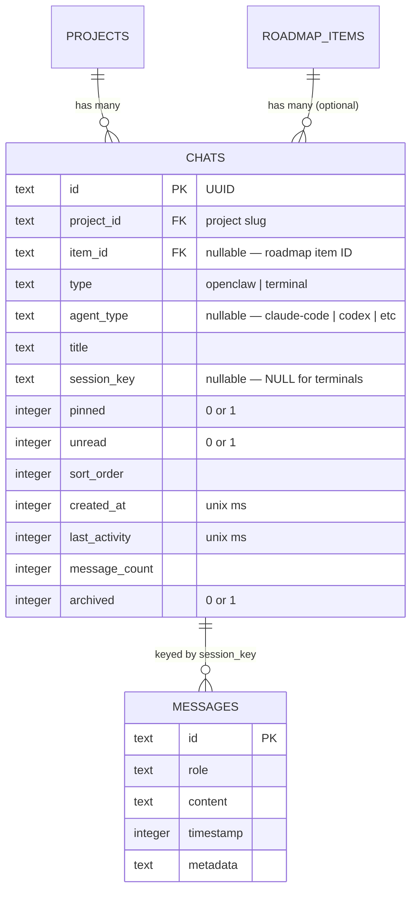

# Project Conversation Hub — Implementation Plan

> Full navigation infrastructure and scoped OpenClaw chat experience. Terminal-ready (schema, type fields, row layout placeholders) but terminal rendering is not built.

## Summary

Build the complete Project Conversation Hub as specified: a sidebar-based thread/chat hierarchy that organises conversations by project and roadmap item, with card-level entry points, a secondary resizable chat drawer, quick-access popover, inline rename, pin/archive/unread management, truncated-name reveal animation, scoped session keys, and context injection — reusing the existing `ChatShell`/`ChatBar`/`MessageList` components for the actual chat experience.

The general chat bar stays untouched. This plan is the **full** spec build (not a phased MVP), minus the actual terminal/agent session rendering (tmux, xterm.js, agent spawning), which is a separate build.

---

## Section Manifest

| # | Section | Purpose |
|---|---------|---------|
| 1 | Architecture Overview | How the hub fits into the existing layout and state |
| 2 | Data Model — `chats` Table | New SQLite table + Rust CRUD commands |
| 3 | Zustand Store Extensions | New hub state slice |
| 4 | Hub Nav Sidebar | New sidebar mode rendering threads + chat entries |
| 5 | Secondary Chat Drawer | Resizable drawer hosting scoped chat |
| 6 | Thin Sidebar Entry Point + Quick Access Popover | Icon, badge, hover popover |
| 7 | Card-Level `MessagesSquare` Icons | Project cards + roadmap item cards |
| 8 | Breadcrumb + Modal Access Points | Additional contextual entry |
| 9 | Row Layout + Hover Affordances | Thread headers, chat rows, hover actions, menus |
| 10 | Truncated Name Reveal Animation | CSS marquee on hover |
| 11 | Session Key Generation + Context Injection | Scoped keys, auto-injected context |
| 12 | Chat Behaviours | Sort, pin, rename, archive, unread, completion indicator, overflow |
| 13 | Implementation Phases + Build Sequence | Ordered work packages |
| 14 | Acceptance Criteria | Measurable outcomes |
| 15 | Risks + Mitigations | What could go wrong |
| 16 | File Manifest | Every file to create or modify |

---

## Research Consolidation

### Internal Patterns (from codebase exploration)

- **Sidebar architecture:** `ThinSidebar.tsx` (44px fixed) + `Sidebar.tsx` (resizable 220-480px, `mode: 'default' | 'settings'`). Mode switching is prop-driven from `App.tsx`. Adding a `'hub'` mode is the natural extension.
- **Chat components:** `ChatShell.tsx` (drawer, message list, input, resize, queue), `ChatBar.tsx` (input, attachments, status), `MessageList.tsx` (messages, streaming, scroll). These are already decoupled from the general chat's session key — they accept props. Reuse is straightforward.
- **Store pattern:** Zustand with `persist` middleware. Persisted keys: `themePreference`, `collapsedColumns`, `minimizedColumns`, `columnOrder`, `sidebarOpen`, `sidebarWidth`, `thinSidebarSide`. Adding `hubState` follows the same pattern.
- **Chat DB:** `src-tauri/src/commands/chat.rs` — SQLite in `~/Library/Application Support/clawchestra/chat.db`. Tables: `messages`, `pending_turns`, `chat_recovery_cursor`. All keyed by session. The `chats` table will live in the same DB.
- **Session keys:** `getResolvedDefaultSessionKey()` in `gateway.ts` returns `agent:main:clawchestra`. Override stored in localStorage. Scoped keys follow the pattern `agent:main:project:{id}` etc.
- **Card hover actions:** `Card.tsx` accepts `renderHoverActions` and `renderRightHoverActions` props. Both use `group-hover` opacity transitions. Adding a `MessagesSquare` icon is a new render function, same pattern.
- **Popover pattern:** `BranchPopover.tsx` — fixed positioning, portal-based, click-outside detection, escape key dismiss. The quick-access popover follows this pattern.
- **DnD:** `@dnd-kit/core` + `@dnd-kit/sortable` already in use for cards and columns. Thread reordering uses the same library.
- **View system:** `ViewContext` is `'projects' | 'roadmap'` — this is for the kanban board view, not sidebar mode. Sidebar mode and view context are orthogonal.

### Institutional Learnings (from docs/solutions/)

- **Architecture refactoring lessons:** Incremental delivery over big-bang rewrites. Each phase should be independently testable. The hub sidebar is additive — doesn't replace or refactor existing sidebar modes.
- **Chat session isolation:** Session keys must be deterministic and derivable from scope. Don't store session keys in multiple places. The `chats` table stores the canonical session key per chat.
- **Chat persistence architecture:** Messages in SQLite are keyed by session key (via the gateway). The `chats` table is metadata only — it doesn't duplicate message storage. This separation is critical.
- **Design principles:** File system is the shared context bridge between sessions. Don't build cross-session message syncing.
- **Token usage:** Context injection must be bounded. Don't inject entire file contents without truncation strategy.

---

## 1. Architecture Overview

### Layout (current → target)

**Current:**
```
[ThinSidebar 44px] [Sidebar 220-480px] [Main column (board + ChatShell)]
```

**Target:**
```
[ThinSidebar 44px] [Sidebar 220-480px] [Secondary Drawer 280-600px?] [Main column (board + ChatShell)]
```

The secondary drawer is **conditionally rendered** between the sidebar and the main column. When closed, layout is identical to today. The sidebar gains a new mode (`'hub'`) in addition to `'default'` and `'settings'`.

### State ownership

| Concern | Owner | Persisted? |
|---------|-------|-----------|
| Hub open/closed | Zustand `sidebarMode === 'hub'` | Yes (persisted in sidebar state) |
| Active chat ID | Zustand `hubActiveChatId` | Yes |
| Secondary drawer open/width | Zustand `hubDrawerOpen`, `hubDrawerWidth` | Yes |
| Chat metadata (threads, chats) | Rust SQLite `chats` table | Yes (DB) |
| Chat messages | Existing gateway + `messages` table | Yes (DB) |
| Thread expand/collapse | Zustand `hubCollapsedThreads` | Yes |
| Thread order | Zustand `hubThreadOrder` | Yes |

### Component tree (new additions in **bold**)

```
App.tsx
├── TitleBar
├── <div flex row>
│   ├── ThinSidebar  (+ MessagesSquare icon, badge)
│   ├── Sidebar      (+ mode='hub' → **HubNav**)
│   ├── **SecondaryDrawer**  (conditionally rendered)
│   │   └── **ScopedChatShell**  (reuses ChatBar + MessageList)
│   └── <main column>
│       ├── Breadcrumb  (+ MessagesSquare icon)
│       ├── Board
│       │   └── Card  (+ MessagesSquare hover action)
│       └── ChatShell  (existing general chat, unchanged)
```

---

## 2. Data Model — `chats` Table

### Schema

```sql
CREATE TABLE IF NOT EXISTS chats (
    id TEXT PRIMARY KEY,               -- UUID
    project_id TEXT NOT NULL,           -- matches project slug
    item_id TEXT,                       -- NULL for project-level chats
    type TEXT NOT NULL DEFAULT 'openclaw',  -- 'openclaw' | 'terminal'
    agent_type TEXT,                    -- NULL for openclaw; 'claude-code' | 'codex' | 'cursor' | 'opencode' | 'generic' for terminals
    title TEXT NOT NULL,
    session_key TEXT,                   -- NULL for terminal sessions
    pinned INTEGER NOT NULL DEFAULT 0,
    unread INTEGER NOT NULL DEFAULT 0,
    sort_order INTEGER NOT NULL DEFAULT 0,  -- for manual reorder within thread
    created_at INTEGER NOT NULL,        -- unix ms
    last_activity INTEGER NOT NULL,     -- unix ms
    message_count INTEGER DEFAULT 0,
    archived INTEGER NOT NULL DEFAULT 0
);

CREATE INDEX IF NOT EXISTS idx_chats_project ON chats(project_id, archived);
CREATE INDEX IF NOT EXISTS idx_chats_project_item ON chats(project_id, item_id);
CREATE INDEX IF NOT EXISTS idx_chats_session_key ON chats(session_key);
CREATE INDEX IF NOT EXISTS idx_chats_last_activity ON chats(last_activity DESC);
```

### Rust Tauri Commands

New file: `src-tauri/src/commands/hub_chats.rs`

| Command | Signature | Notes |
|---------|-----------|-------|
| `hub_chat_create` | `(project_id, item_id?, type, agent_type?, title) → HubChat` | Generates UUID, session key, timestamps |
| `hub_chat_list` | `(project_id?, include_archived?) → Vec<HubChat>` | Returns all chats, optionally filtered by project |
| `hub_chat_get` | `(chat_id) → HubChat` | Single chat by ID |
| `hub_chat_update` | `(chat_id, title?, pinned?, unread?, archived?, sort_order?, last_activity?, message_count?) → HubChat` | Partial update |
| `hub_chat_delete` | `(chat_id) → ()` | Hard delete |
| `hub_chat_update_activity` | `(chat_id) → ()` | Bumps `last_activity` to now |
| `hub_thread_list` | `() → Vec<HubThread>` | Returns project threads (grouped chats) for sidebar rendering |

### TypeScript Types

```typescript
// src/lib/hub-types.ts

export interface HubChat {
  id: string;
  projectId: string;
  itemId: string | null;
  type: 'openclaw' | 'terminal';
  agentType: 'claude-code' | 'codex' | 'cursor' | 'opencode' | 'generic' | null;
  title: string;
  sessionKey: string | null;
  pinned: boolean;
  unread: boolean;
  sortOrder: number;
  createdAt: number;
  lastActivity: number;
  messageCount: number;
  archived: boolean;
}

export interface HubThread {
  projectId: string;
  projectTitle: string;
  chats: HubChat[];
}
```

### Session Key Generation

In `src/lib/hub-session.ts`:

```typescript
export function generateSessionKey(
  projectId: string,
  itemId?: string,
  chatId?: string,
): string {
  if (chatId) return `agent:main:project:${projectId}:chat:${chatId}`;
  if (itemId) return `agent:main:project:${projectId}:item:${itemId}`;
  return `agent:main:project:${projectId}`;
}
```

Session key is computed at chat creation time and stored in the `chats` table. It never changes.

---

## 3. Zustand Store Extensions

### New State Fields

Add to `DashboardState` in `store.ts`:

```typescript
// Hub state
sidebarMode: 'default' | 'settings' | 'hub';
hubActiveChatId: string | null;
hubDrawerOpen: boolean;
hubDrawerWidth: number;
hubCollapsedThreads: string[];  // project IDs that are collapsed
hubThreadOrder: string[];       // project IDs in display order
hubChats: HubChat[];            // cached from DB, refreshed on mutations

// Hub actions
setSidebarMode: (mode: 'default' | 'settings' | 'hub') => void;
setHubActiveChatId: (id: string | null) => void;
setHubDrawerOpen: (open: boolean) => void;
setHubDrawerWidth: (width: number) => void;
toggleHubThread: (projectId: string) => void;
setHubThreadOrder: (order: string[]) => void;
setHubChats: (chats: HubChat[]) => void;
refreshHubChats: () => Promise<void>;
```

### Persistence

Add to the `persist` partialize:

```typescript
sidebarMode: true,
hubActiveChatId: true,
hubDrawerOpen: true,
hubDrawerWidth: true,
hubCollapsedThreads: true,
hubThreadOrder: true,
// hubChats is NOT persisted in Zustand — it's loaded from SQLite on startup
```

### Derived State (computed in components, not stored)

```typescript
// Computed per render in HubNav:
const threads: HubThread[] = useMemo(() => {
  // Group hubChats by projectId, attach projectTitle from projects[]
  // Sort threads by hubThreadOrder
  // Sort chats within thread: pinned first, then by lastActivity DESC
  // Apply 5-chat visible limit with overflow
}, [hubChats, projects, hubThreadOrder]);
```

---

## 4. Hub Nav Sidebar

### File: `src/components/sidebar/HubNav.tsx`

This component renders when `sidebarMode === 'hub'`. It replaces the default sidebar content (project list, settings) while keeping the same resizable container.

### Structure

```
<div className="flex h-full flex-col">
  {/* Header */}
  <div className="flex items-center justify-between border-b px-3 py-2">
    <span className="text-sm font-semibold">Conversations</span>
    <button onClick={back-to-default}>×</button>
  </div>

  {/* Thread list — scrollable */}
  <div className="flex-1 overflow-y-auto">
    {threads.map(thread => (
      <ThreadSection key={thread.projectId} thread={thread} />
    ))}
  </div>

  {/* Footer — "New project thread" */}
  <div className="border-t px-3 py-2">
    <button>+ New project thread</button>
  </div>
</div>
```

### ThreadSection Component

`src/components/hub/ThreadSection.tsx`

Renders:
- **Thread header row** (project name, folder/chevron, + button, ⋯ menu)
- **Chat entry rows** (indented, with pin/archive/⋯ hover actions)
- **"Show N more..."** overflow when >5 non-pinned chats

Thread headers are drag-reorderable using `@dnd-kit/sortable`.

### ChatEntryRow Component

`src/components/hub/ChatEntryRow.tsx`

Renders a single chat entry with:
- Type icon (💬 for openclaw, terminal icons for future)
- Chat name with truncation + hover reveal animation
- Pin icon (left indent, hover-reveal, persistent when pinned)
- Archive icon (right edge, hover-reveal)
- ⋯ menu (far right, hover-reveal)
- Active state highlighting when `hubActiveChatId === chat.id`
- Click handler: sets `hubActiveChatId` + opens drawer

---

## 5. Secondary Chat Drawer

### File: `src/components/hub/SecondaryDrawer.tsx`

A resizable panel that renders between the sidebar and the main column. Hosts a `ScopedChatShell` for the active hub chat.

### Behaviour

- **Resizable:** Drag handle on the right edge (mirroring sidebar pattern from `Sidebar.tsx`)
- **Width range:** 280px min, 600px max, 400px default
- **Persisted:** Width stored in Zustand `hubDrawerWidth`
- **Close control:** `×` button in top-right corner of drawer header
- **Content updates:** Changing `hubActiveChatId` swaps the chat content without closing/reopening the drawer
- **Header:** Shows chat title, type badge, project breadcrumb, close button

### ScopedChatShell

`src/components/hub/ScopedChatShell.tsx`

A wrapper that reuses the existing chat components with a scoped session key:

```typescript
function ScopedChatShell({ chat }: { chat: HubChat }) {
  // Uses chat.sessionKey instead of the default session key
  // Renders ChatBar (variant='embedded') + MessageList
  // Manages its own message state, send flow, and streaming
  // Context injection happens at send time (see Section 11)
}
```

This is essentially a scoped version of the existing `ChatShell` — same message list, same input bar, same streaming, same tool call visibility. The key differences:
1. Session key comes from the `HubChat` record
2. Context is pre-injected based on scope
3. Variant is `'embedded'` (no floating, no toggle)
4. No ResponseToast (that's for the general chat only)

### Layout Integration

In `App.tsx`, the secondary drawer renders conditionally:

```tsx
<div className="flex min-h-0 flex-1">
  <ThinSidebar ... />
  <Sidebar ... />
  {hubDrawerOpen && hubActiveChatId && (
    <SecondaryDrawer
      chatId={hubActiveChatId}
      width={hubDrawerWidth}
      onWidthChange={setHubDrawerWidth}
      onClose={() => setHubDrawerOpen(false)}
    />
  )}
  <div className="relative flex min-w-0 flex-1 flex-col p-4 md:p-6">
    {/* breadcrumb, board, general chat */}
  </div>
</div>
```

The main column has `min-w-0 flex-1` so it shrinks naturally when the drawer opens.

---

## 6. Thin Sidebar Entry Point + Quick Access Popover

### MessagesSquare Icon

Add to `ThinSidebar.tsx`:

```tsx
import { MessagesSquare } from 'lucide-react';

// In the icon list, after existing buttons:
<ThinSidebarButton
  icon={MessagesSquare}
  label="Conversations"
  onClick={onToggleHub}
  ariaLabel="Toggle conversation hub"
  badgeCount={totalUnreadCount}
  active={sidebarMode === 'hub'}
/>
```

New prop: `onToggleHub: () => void` — toggles sidebar mode between `'hub'` and `'default'`.

Badge count: sum of all `unread === true` chats across all projects.

### Quick Access Popover

`src/components/hub/QuickAccessPopover.tsx`

Triggered on hover over the MessagesSquare icon (300ms delay). Uses the `BranchPopover` pattern (portal, fixed positioning, click-outside).

**Contents:** Up to 5 entries:
1. Chats with `unread === true`, sorted by `lastActivity DESC`
2. Remaining slots: most recently active chats

Each entry shows:
- Type icon
- Chat name (truncated)
- Project name (smaller, below)
- Notification indicator (dot or label)
- Relative timestamp ("2m ago")

**Click:** Opens hub sidebar to that chat's thread + opens secondary drawer to that chat.

**Empty state:** "No chats yet. Open a project card to start one."

**Dismissal:** 200ms grace period on mouse-leave (so cursor can travel from icon to popover).

---

## 7. Card-Level `MessagesSquare` Icons

### Project Cards (Board.tsx / App.tsx)

Add a `MessagesSquare` icon to project card hover actions via the existing `renderRightHoverActions` prop.

**States:**
- **No thread exists** (no chats for this project): unfilled icon, tooltip "Create Thread"
- **Thread exists**: filled icon with `#DFFF00` colour, tooltip "Open Thread"
- **Thread exists + unread**: filled + small dot badge, tooltip "Open Thread (N unread)"

**Click handler:**
1. If no chats exist for this project → create project-level chat via `hub_chat_create` → open hub sidebar + drawer
2. If chats exist → open hub sidebar to thread + drawer to most-recent or project-level chat

### Roadmap Item Cards (App.tsx `renderItemRightHoverActions`)

Same `MessagesSquare` icon, positioned to the left of existing lifecycle buttons.

**States:** Same as project cards but scoped to item-level chat existence.

**Click handler:**
1. If no item chat exists → create item-level chat (also creates project thread if needed) → open hub + drawer
2. If item chat exists → open hub + drawer to that chat

### Implementation

```typescript
// src/lib/hub-actions.ts

export async function openOrCreateProjectChat(projectId: string, projectTitle: string): Promise<void> {
  const store = useDashboardStore.getState();
  let chats = store.hubChats.filter(c => c.projectId === projectId && !c.archived);

  if (chats.length === 0) {
    // Create project-level chat
    const newChat = await invoke('hub_chat_create', {
      projectId,
      itemId: null,
      type: 'openclaw',
      agentType: null,
      title: projectTitle,
    });
    await store.refreshHubChats();
    chats = [newChat];
  }

  const target = chats.find(c => !c.itemId) ?? chats[0];
  store.setSidebarMode('hub');
  store.setSidebarOpen(true);
  store.setHubActiveChatId(target.id);
  store.setHubDrawerOpen(true);
}

export async function openOrCreateItemChat(
  projectId: string,
  projectTitle: string,
  itemId: string,
  itemTitle: string,
): Promise<void> {
  // Similar: find or create item-level chat, open hub + drawer
}
```

---

## 8. Breadcrumb + Modal Access Points

### Breadcrumb `MessagesSquare`

In the breadcrumb component (rendered in `App.tsx` above the board), when the view is `type: 'roadmap'` (inside a project), add a `MessagesSquare` icon to the right of the project name breadcrumb.

Same filled/unfilled/badge logic. Click opens hub to the project thread.

### Roadmap Item Modal

In the roadmap item detail modal (opened when clicking a roadmap item card), add a `MessagesSquare` icon in the modal header area.

Same states. Click opens hub + drawer to the item's chat, keeping the modal open. This gives the user side-by-side reference (spec/plan in modal, chat in drawer).

---

## 9. Row Layout + Hover Affordances

### Thread Header Row

```
[📁/▾]  Project Name ····················  [+ hover]  [⋯ hover]
```

- **Far left:** Folder icon (resting) → chevron (hover). Open/closed folder for expand/collapse state.
- **Middle:** Project name. Double-click to rename (inline edit). Truncation + hover reveal.
- **Right (hover):** `+` button → type picker popover (OpenClaw chat default, terminal types disabled/greyed out with "Coming soon" label).
- **Far right (hover):** `⋯` menu → Expand all / Collapse all.
- **Drag:** Thread headers are drag-reorderable. Drag zone = folder icon + name area. `+` and `⋯` are excluded from drag handle.

### Chat Entry Row

```
  [📌 hover]  Chat Name ·················  [🗄 hover]  [⋯ hover]
```

- **Left indent:** Pin icon, hidden by default, fade-in on hover. Persistent + filled when pinned.
- **Middle:** Chat name. Single-click opens chat. Double-click renames (inline edit, Enter confirm, Escape cancel, blur save).
- **Right (hover):** Archive icon. Click archives with snackbar undo.
- **Far right (hover):** `⋯` menu → Mark as unread/read, Open linked item (conditional), Delete (danger, separated).

### Hover Behaviour (shared)

All hover-only elements: `opacity-0 group-hover:opacity-100 transition-opacity duration-150`.

When a menu is open: all hover elements stay visible until menu dismisses.

`⋯` is focusable (keyboard accessible): Enter/Space opens, Escape closes.

Dropdown: compact popover (not modal), positioned below or above based on available space.

Destructive actions: separated by divider, rendered in `text-status-danger`.

### Inline Rename

Reusable `InlineEdit` component (`src/components/hub/InlineEdit.tsx`):
- Double-click triggers edit mode
- Shows text input replacing label
- Enter confirms, Escape cancels, blur saves
- Calls `hub_chat_update` with new title
- Same component used for thread header rename and chat entry rename

---

## 10. Truncated Name Reveal Animation

### CSS Implementation

`src/components/hub/ScrollRevealText.tsx`:

```tsx
function ScrollRevealText({ text, className }: { text: string; className?: string }) {
  const containerRef = useRef<HTMLDivElement>(null);
  const textRef = useRef<HTMLSpanElement>(null);
  const [overflowPx, setOverflowPx] = useState(0);

  useLayoutEffect(() => {
    if (!containerRef.current || !textRef.current) return;
    const containerWidth = containerRef.current.clientWidth;
    const textWidth = textRef.current.scrollWidth;
    setOverflowPx(Math.max(0, textWidth - containerWidth));
  }, [text]);

  const hasOverflow = overflowPx > 0;
  // Scale duration: ~40px/sec, min 1s, max 4s
  const duration = hasOverflow ? Math.min(4, Math.max(1, overflowPx / 40)) : 0;

  return (
    <div
      ref={containerRef}
      className={`overflow-hidden ${className}`}
    >
      <span
        ref={textRef}
        className="inline-block whitespace-nowrap"
        style={{
          '--overflow-distance': `-${overflowPx}px`,
          '--scroll-duration': `${duration}s`,
        } as React.CSSProperties}
        // CSS class applies animation on parent hover
      >
        {text}
      </span>
    </div>
  );
}
```

**CSS (in `src/index.css` or scoped):**

```css
.hub-row:hover .scroll-reveal-text {
  animation: scroll-reveal var(--scroll-duration, 1.5s) ease-in-out 300ms forwards;
}

@keyframes scroll-reveal {
  0% { transform: translateX(0); }
  80% { transform: translateX(var(--overflow-distance, 0)); }
  100% { transform: translateX(var(--overflow-distance, 0)); }
}
```

- 300ms delay prevents flicker on mouse-through
- Holds at end for ~20% of duration
- On hover-out: animation stops, element snaps back (no lingering mid-scroll)
- Right-edge buttons have reserved `padding-right` so text never overlaps them

---

## 11. Session Key Generation + Context Injection

### Session Keys

Generated at chat creation time by `hub_chat_create` (Rust side):

| Scope | Pattern | Example |
|-------|---------|---------|
| Project general | `agent:main:project:{project_id}` | `agent:main:project:clawchestra` |
| Roadmap item | `agent:main:project:{project_id}:item:{item_id}` | `agent:main:project:clawchestra:item:git-sync` |
| Ad-hoc chat | `agent:main:project:{project_id}:chat:{uuid}` | `agent:main:project:clawchestra:chat:a1b2c3d4` |
| Terminal | NULL (no OpenClaw session) | — |

### Context Injection

When a scoped chat sends its first message (or opens with empty history), context is injected as a system-level preamble. This uses the existing `injectAgentGuidance` Tauri command pattern but with scope-specific content.

New Rust command: `hub_inject_scoped_context`

| Scope | Injected Content |
|-------|-----------------|
| Project general | `CLAWCHESTRA.md` content, `state.json` roadmap items for that project, project `AGENTS.md` (if exists) |
| Roadmap item | All project context + item detail file (`roadmap/{item-id}.md`), spec doc, plan doc (if they exist) |
| Ad-hoc chat | Project context only (user provides specifics) |

**Truncation strategy:** Each injected file is capped at 4000 chars. If total injection exceeds 12000 chars, files are prioritised: CLAWCHESTRA.md > state.json items > item detail > spec > plan > AGENTS.md.

**Implementation:** The `ScopedChatShell` calls `hub_inject_scoped_context(chatId)` on mount. The Rust side reads the chat's project/item scope, gathers the files from the project directory, and returns a formatted context string. The frontend prepends this as the first system message in the session.

---

## 12. Chat Behaviours

### Sorting

Within each thread, chats are sorted:
1. **Pinned chats first** (pinned + most recent activity at top)
2. **Non-pinned chats by `lastActivity` DESC**

### 5-Chat Visible Limit

Only 5 non-pinned chats are visible per thread. Pinned chats are always visible regardless of the limit. A "Show N more..." button below the 5th entry expands the full list.

### Pin

Pin icon in left indent zone of chat row. Click toggles `pinned` via `hub_chat_update`. Pinned chats show the pin icon persistently (not just on hover), filled/coloured.

### Rename

Double-click the chat name → inline edit. Saves via `hub_chat_update`. Chat names auto-infer from first message content (lightweight, optional — if the user hasn't manually renamed).

### Archive

Archive icon at right edge of chat row. Click sets `archived: true` via `hub_chat_update`. Shows snackbar with undo (5 seconds). Archived chats disappear from the main thread view but are accessible via an "Archived" section at the bottom of the thread (collapsible, greyed out).

### Mark as Unread

Via `⋯` menu. Sets `unread: true` via `hub_chat_update`. Unread chats show a dot indicator. Reading the chat (opening it) clears `unread`.

### Completion Indicator

When a roadmap item linked to a chat reaches `status: 'complete'`, the chat row shows a subtle checkmark and greyed title. Does NOT auto-archive.

### Message Count

`message_count` is updated by the frontend after each send/receive cycle via `hub_chat_update_activity`. This is lightweight metadata — actual messages live in the gateway session.

### Last Activity

`last_activity` is bumped whenever:
- A message is sent or received in the chat
- The chat is opened (reading counts as activity for sorting purposes)

---

## 13. Implementation Phases + Build Sequence

### Phase A: Data Layer + Store (foundation)

**Files to create:**
- `src-tauri/src/commands/hub_chats.rs` — SQLite table + CRUD commands
- `src/lib/hub-types.ts` — TypeScript types
- `src/lib/hub-session.ts` — Session key generation
- `src/lib/hub-actions.ts` — Open/create chat action helpers

**Files to modify:**
- `src-tauri/src/lib.rs` — Register new commands, add `mod hub_chats` to `commands/mod.rs`
- `src-tauri/src/commands/chat.rs` → `init_chat_db()` — Add `chats` table creation
- `src/lib/store.ts` — Add hub state fields + actions
- `src/lib/tauri.ts` — Add invoke wrappers for new commands

**Verification:** `npx tsc --noEmit` passes, `bun test` passes, new Tauri commands callable from frontend.

### Phase B: Hub Nav Sidebar

**Files to create:**
- `src/components/hub/HubNav.tsx` — Hub sidebar content
- `src/components/hub/ThreadSection.tsx` — Thread header + children
- `src/components/hub/ChatEntryRow.tsx` — Individual chat row
- `src/components/hub/InlineEdit.tsx` — Double-click rename component
- `src/components/hub/ScrollRevealText.tsx` — Truncated name reveal
- `src/components/hub/ChatTypeIcon.tsx` — Icon discriminator (💬 vs terminal icons)

**Files to modify:**
- `src/components/sidebar/Sidebar.tsx` — Add `mode === 'hub'` branch rendering `<HubNav />`
- `src/components/sidebar/ThinSidebar.tsx` — Add MessagesSquare icon + onToggleHub prop
- `src/App.tsx` — Pass `sidebarMode`, `onToggleHub` handler, hub props to sidebar/thin sidebar

**Verification:** Hub sidebar opens/closes, threads display, chats list, expand/collapse works, inline rename works, scroll reveal animates.

### Phase C: Secondary Chat Drawer

**Files to create:**
- `src/components/hub/SecondaryDrawer.tsx` — Resizable drawer container
- `src/components/hub/ScopedChatShell.tsx` — Scoped chat wrapper (reuses ChatBar, MessageList)
- `src/components/hub/DrawerHeader.tsx` — Title, breadcrumb, close button

**Files to modify:**
- `src/App.tsx` — Render `SecondaryDrawer` in layout between sidebar and main column
- `src/lib/gateway.ts` — `sendMessage` needs to accept a `sessionKey` override so scoped chats use their own session

**Verification:** Clicking a chat in hub nav opens the drawer, chat messages load/send with scoped session key, drawer resizes, drawer closes independently of hub nav.

### Phase D: Card-Level Entry Points

**Files to modify:**
- `src/App.tsx` — Add `renderRightHoverActions` for project cards (MessagesSquare icon), update `renderItemRightHoverActions` for roadmap items
- `src/components/Card.tsx` — No changes needed (already accepts `renderRightHoverActions`)
- `src/lib/hub-actions.ts` — `openOrCreateProjectChat()`, `openOrCreateItemChat()` — handles auto-creation

**Verification:** Hovering project cards shows MessagesSquare, clicking creates thread if needed and opens hub + drawer. Same for roadmap item cards.

### Phase E: Quick Access Popover + Additional Entry Points

**Files to create:**
- `src/components/hub/QuickAccessPopover.tsx` — Hover popover on thin sidebar icon

**Files to modify:**
- `src/components/sidebar/ThinSidebar.tsx` — Wire up hover on MessagesSquare for popover
- `src/App.tsx` — Breadcrumb MessagesSquare icon, modal MessagesSquare icon

**Verification:** Hovering hub icon shows popover with recent chats, clicking an entry opens drawer. Breadcrumb and modal icons work.

### Phase F: Chat Management (pin, archive, unread, overflow, menus)

**Files to modify:**
- `src/components/hub/ChatEntryRow.tsx` — Pin toggle, archive action, ⋯ menu with mark-unread/delete
- `src/components/hub/ThreadSection.tsx` — "Show N more..." overflow, thread ⋯ menu (expand/collapse all)
- `src/components/hub/HubNav.tsx` — Archived chats section at bottom of thread

**Verification:** Pin persists across restarts, archive with undo works, mark-unread shows badge, 5-chat limit with overflow expands.

### Phase G: Context Injection + Polish

**Files to create:**
- `src-tauri/src/commands/hub_context.rs` — Scoped context injection command

**Files to modify:**
- `src/components/hub/ScopedChatShell.tsx` — Call context injection on mount
- `src-tauri/src/commands/mod.rs` — Register context command

**Verification:** Opening a project chat pre-injects project context. Opening an item chat injects item-specific context. Truncation respects limits.

---

## 14. Acceptance Criteria

### Functional

- [ ] Hub sidebar opens from thin sidebar icon (click toggle)
- [ ] Hub sidebar displays project threads with chat entries
- [ ] Threads expand/collapse, state persists across restarts
- [ ] Threads are drag-reorderable, order persists
- [ ] Chat entries show type icon, name, hover actions
- [ ] Clicking a chat opens the secondary drawer with scoped chat
- [ ] Secondary drawer is resizable (280-600px), width persists
- [ ] Closing drawer leaves hub nav visible
- [ ] Switching chats in hub nav updates drawer content without close/reopen
- [ ] Project card MessagesSquare icon: unfilled (no thread) → filled (thread exists) → badge (unread)
- [ ] Roadmap item card MessagesSquare icon: same states, scoped to item
- [ ] Clicking MessagesSquare auto-creates thread/chat if needed
- [ ] Breadcrumb MessagesSquare icon opens project thread
- [ ] Modal MessagesSquare icon opens item chat, modal stays open
- [ ] Quick access popover shows 5 recent/unread chats on hover (300ms delay)
- [ ] Clicking popover entry opens drawer directly
- [ ] Pin: toggle via icon, pinned chats always visible, persist
- [ ] Rename: double-click inline edit, Enter/Escape/blur behaviour
- [ ] Archive: click archive icon, snackbar undo, archived section viewable
- [ ] Mark as unread: via ⋯ menu, dot indicator, cleared on open
- [ ] Completion indicator: linked item `complete` → checkmark + greyed title
- [ ] 5-chat visible limit with "Show N more..." overflow
- [ ] Truncated name reveal animation on hover (300ms delay, smooth scroll)
- [ ] Scoped session keys: project-level, item-level, ad-hoc
- [ ] Context injection: project files injected on first open, capped at limits
- [ ] General chat is unchanged and fully functional
- [ ] Chat messages persist in SQLite via existing message infrastructure
- [ ] Chat metadata persists in new `chats` table

### Non-Functional

- [ ] `npx tsc --noEmit` passes
- [ ] `bun test` passes (no regressions)
- [ ] Hub sidebar renders in <50ms (no jank on open)
- [ ] Secondary drawer resize is 60fps (RAF-based, matching sidebar pattern)
- [ ] SQLite queries use indices — no full table scans

---

## 15. Risks + Mitigations

| Risk | Impact | Mitigation |
|------|--------|------------|
| Drawer + sidebar + board compete for width on narrow screens | Board becomes too narrow to use | Main column has `min-w-0 flex-1` + add `min-width: 400px` floor. If window is too narrow, drawer overlaps board with a z-index layer (overlay mode). |
| Scoped sessions create many gateway sessions | Memory/connection overhead | Sessions are lazy — only opened when user clicks into a chat. Inactive sessions don't maintain connections. |
| Context injection too large | Exceeds token limits | Hard cap at 12000 chars total, per-file cap at 4000 chars. Truncate with `[...truncated]` marker. |
| Inline rename conflicts with click-to-open | UX ambiguity: single-click opens, double-click renames | Use standard timing: <300ms = single-click (open), ≥300ms = hold, double-click = rename. `setTimeout` debounce pattern. |
| Chat metadata out of sync with gateway messages | `message_count` or `last_activity` stale | These are advisory — used for sorting/display only. They don't need to be exact. Periodic refresh on hub open. |
| Existing chat tests break | Regression | Scoped chat uses the same underlying infrastructure with a different session key. No changes to existing chat flow. |
| Terminal row types visible but non-functional | User confusion | Terminal type in `+` picker is greyed out with "Coming soon" label. Terminal rows can't be created. Schema supports them. |

---

## 16. File Manifest

### New Files (14)

| File | Purpose |
|------|---------|
| `src-tauri/src/commands/hub_chats.rs` | SQLite `chats` table + CRUD Tauri commands |
| `src-tauri/src/commands/hub_context.rs` | Scoped context injection command |
| `src/lib/hub-types.ts` | TypeScript types for `HubChat`, `HubThread` |
| `src/lib/hub-session.ts` | Session key generation helpers |
| `src/lib/hub-actions.ts` | Open/create chat action helpers (used by cards, breadcrumb, modal) |
| `src/components/hub/HubNav.tsx` | Hub sidebar navigation content |
| `src/components/hub/ThreadSection.tsx` | Thread header + chat entries container |
| `src/components/hub/ChatEntryRow.tsx` | Individual chat entry row with hover actions |
| `src/components/hub/ChatTypeIcon.tsx` | Icon discriminator by chat type |
| `src/components/hub/InlineEdit.tsx` | Double-click rename component |
| `src/components/hub/ScrollRevealText.tsx` | Truncated name hover reveal animation |
| `src/components/hub/SecondaryDrawer.tsx` | Resizable secondary drawer container |
| `src/components/hub/ScopedChatShell.tsx` | Scoped chat wrapper (reuses existing chat components) |
| `src/components/hub/QuickAccessPopover.tsx` | Hover popover on thin sidebar icon |

### Modified Files (10)

| File | Changes |
|------|---------|
| `src-tauri/src/commands/mod.rs` | Add `pub mod hub_chats; pub mod hub_context;` |
| `src-tauri/src/commands/chat.rs` | Add `chats` table creation in `init_chat_db()` |
| `src-tauri/src/lib.rs` | Register new Tauri commands |
| `src/lib/store.ts` | Add hub state fields + actions + persistence keys |
| `src/lib/tauri.ts` | Add invoke wrappers for hub commands |
| `src/lib/gateway.ts` | Accept `sessionKey` override in send flow |
| `src/components/sidebar/Sidebar.tsx` | Add `mode === 'hub'` branch |
| `src/components/sidebar/ThinSidebar.tsx` | Add MessagesSquare icon + hub toggle + popover trigger |
| `src/App.tsx` | Layout integration (drawer), card hover actions, breadcrumb icon, modal icon, hub state wiring |
| `src/index.css` | Scroll-reveal animation keyframes |

---

## ERD: Chat Data Model



---

## References

### Internal
- Spec: `docs/specs/project-conversation-hub-spec.md` (609 lines, decisions resolved)
- Sidebar: `src/components/sidebar/Sidebar.tsx` (resizable, mode switching)
- Thin sidebar: `src/components/sidebar/ThinSidebar.tsx` (44px, icon buttons)
- Chat shell: `src/components/chat/ChatShell.tsx` (drawer, message list, input)
- Chat bar: `src/components/chat/ChatBar.tsx` (input, status, attachments)
- Chat DB: `src-tauri/src/commands/chat.rs` (SQLite, messages table)
- Store: `src/lib/store.ts` (Zustand, persist middleware)
- Gateway: `src/lib/gateway.ts` (session keys, transport)
- Card: `src/components/Card.tsx` (DnD, hover actions)
- Popover pattern: `src/components/BranchPopover.tsx`
- Views: `src/lib/views.ts` (ViewContext type)

### Related specs
- `docs/specs/distributed-ai-surfaces-spec.md` — multi-surface foundation
- `docs/specs/scoped-chat-sessions-spec.md` — session key isolation
- `docs/specs/embedded-agent-terminals-spec.md` — terminal sessions (future build)
